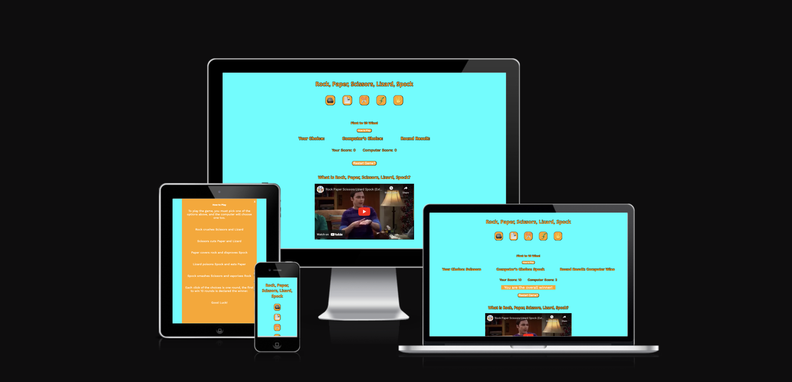
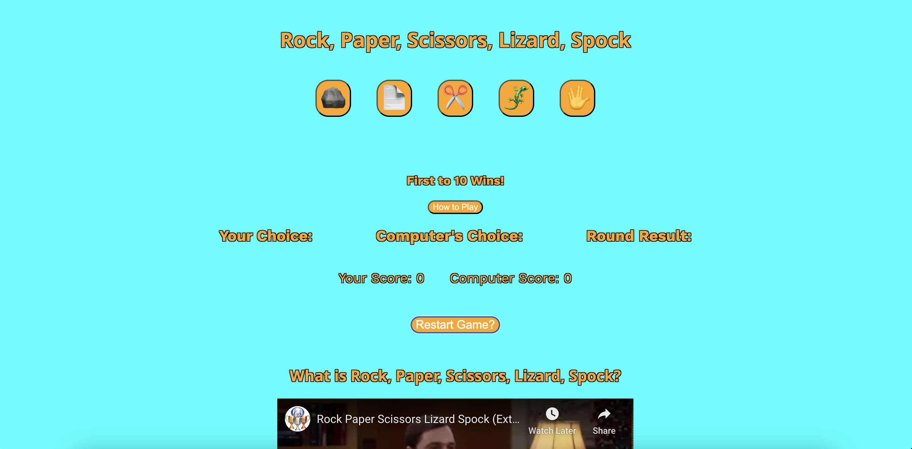
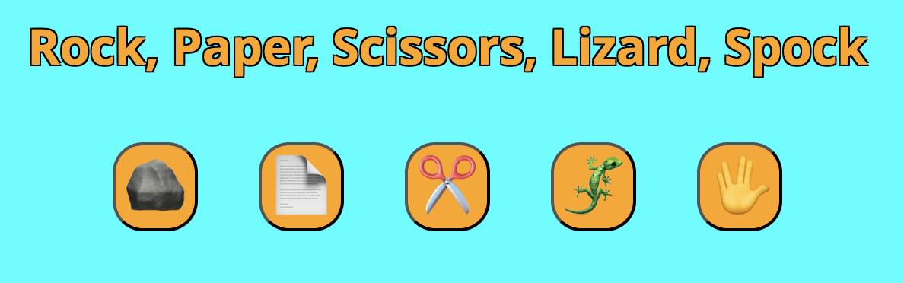
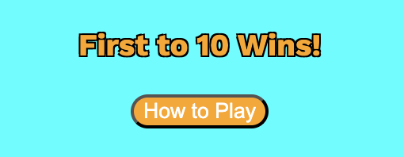
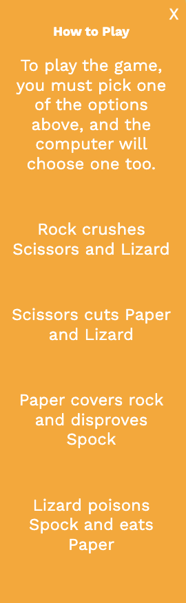
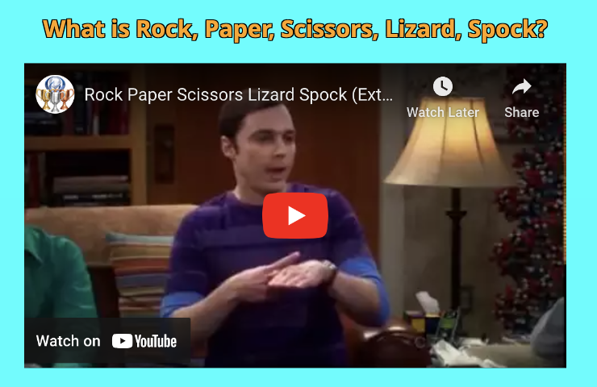

# Rock, Paper, Scissors, Lizard, Spock

My Rock, Paper, Scissors, Lizard, Spock website is a one page website, allowing users to play an online version of the game against a computer opponent.
## User Experience

- The users of the site are first greeted by a vibrant, bright and cheerful site which incorporates an aquamarine background with orange foreground features, creating a good, readable contrast while still maintaining an element of fun.

- On opening the site, the title of the game appears at the top, and below they are presented with a series of buttons representing the game's choices, with a challenge message below outlining the goal of the game - to reach 10 wins.

- Many people are already familiar with the basic concept of the game, but to avoid confusion, below the challenge message, users are able to find game instructions in a popup that appears when clicking the 'How to Play' button, ensuring that even if they are totally new to the game they will still be able to grasp the concept and enjoy the game like anyone else.

- To ensure the user is presented with some feedback on the choices they are making, the game is split into rounds, as indicated by the challenge message and How to Play instructions, initiated by each click of the game choices, and every round the user is given the feedback of what they chose, what the computer they are playing against chose, and what the result of the round was.

- Each time a round is played, if the round has a winner, this is tallied below, adding 1 point to the counter. If the round ended as a tie, in the instance of both the user and computer picking the same option, neither player will earn a point.

- It does not matter if the round ends in a tie, as the overall winner of the game is only determined by who reaches 10 points first. If the user reaches 10 wins first, they are congratulated, or if the computer reaches 10 wins first, the user is also informed of this outcome and are encouraged to play a new game.
- The user can decide to restart the game, refreshing all scores and entries, at any time by clicking the restart game button.

- Finally, to provide context for why the game is Rock, Paper, Scissors, Lizard, Spock and not just the traditional Rock, Paper, Scissors, there is a context section where a Youtube video iframe is incorporated that is a clip of a scene from the TV series The Big Bang Theory from which the game was created.

## Features

- At the top of the site, the first thing the user will likely see and read, is the title and the options of the game. I chose to make the options as emojis rather than just plain text, to add to the visual appeal of the site and give the game a more modern outlook. Coincidentally, the title above the options almost act as an additional label for them as the words almost exactly corrrespond with what option is below them, giving a feeling of consistency.

- Below the options for the game, we have a challenge message that is used to outline to the user what the goal of the game is, making this unambiguous. 
- As previously mentioned, it is important that anyone who makes their way to the site should be able to play the game, and so while many know the basic rules of the game, these are outlined in a seperate div that only appears in the event that someone clicks the 'How to Play' button. This keeps the page from becoming cluttered with information that might be completely unneeded by the typical user.

- As with any game, feedback is important for the user to see so that they can understand how the game is going. As each click of an option is defined as 1 round of play, the user is provided a range of feedback. Notably, they are presented with what option they chose, what the computer chose, and finally, what the outcome of the round was, whether they won, lost, or tied the round.
- The winner of the game itself is decided by who reaches 10 winning rounds, and each round win accumulates 1 point to either the computer or the user, and no one gets a point if the round was a tie, and the progress of the game is easy to follow by the score counters for either player.

- When the game is finished, meaning the computer or user has reached 10 rounds won, a message is displayed to signify who the winner was. The user is congratulated if they are the winner, or alternatively if the computer wins, the user is informed of this, but it is also then suggested to them to play another game, which encourages replayability. 

- The user is given the option to restart the game at any point they want. This will reset the score counters for both players, and clear the results of the previous round. This feature is important as it allows the user to start over if they aren't enjoying the current game's outcomes, or to restart the game again if the overall winner has been decided and they want to play again.

- At the bottom of the page, there is an iframe showcasing a Youtube video of the Big Bang Theory Scene where the game of Rock, Paper, Scissors, Lizard, Spock was created, which provides the user with context regarding the game, and having the video inside the page creates a positive user experience by allowing them to watch the video from the site itself without having to go anywhere external and taking away from the site's functionality.

## Typography
- The fonts used on the site are Work Sans and Noto Sans. These are both sans fonts and I decided to use them for their modern and fun styling, which fits with the overall image of the site being centered around a game.

## Accessibility 
- I have made sure that the site is accessible to as many people as possible. Measures I have taken to ensure this are by using semantic HTML, consistent colour contrast throughout the site, big buttons and feedback to what choices have been made, and instructions available to be read at the click of the 'How to Play' button. 
- The site has also been optimised to be able to be viewed and played on a range of screen sizes, whether it be a large desktop monitor or one of the smallest phone sizes, such as the folded screen on the Samsung Galaxy Z Fold 5 by making most elements responsive or through media queries altering the layout of the site.

## Languages Used
- This website was structured using HTML, and styled using CSS. The functionality of elements such as the game, restart button and 'How to Play' instructions was implemented using JavaScript.

